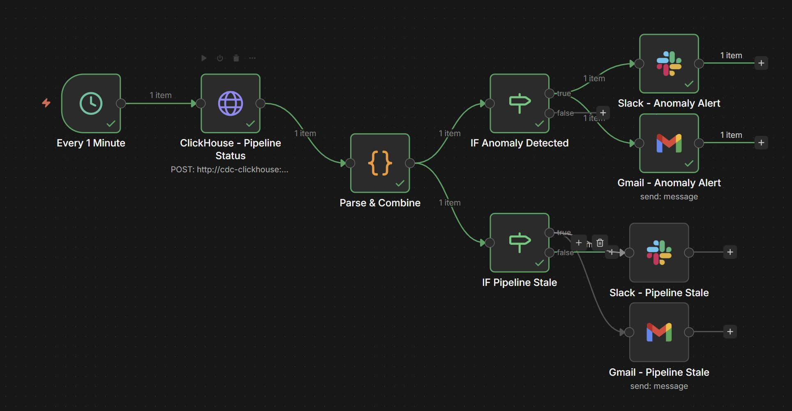
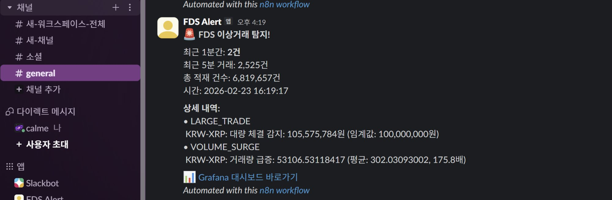
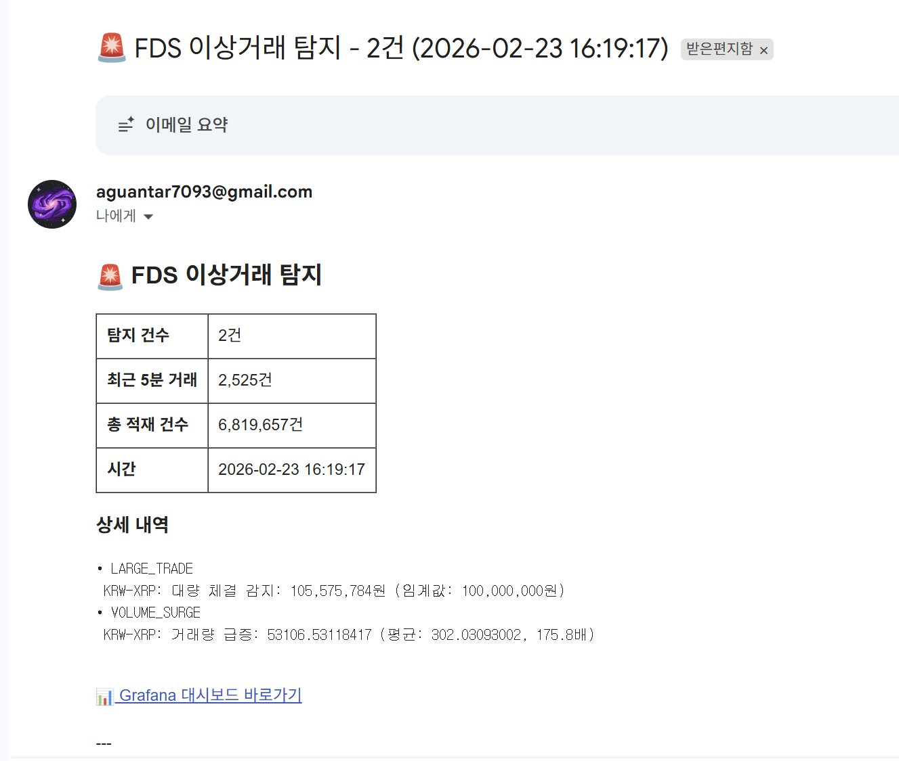

# 🚀 On-Premise Real-time CDC Pipeline

> **물리 서버 기반 암호화폐 실시간 변경 데이터 캡처 및 이상 탐지 플랫폼**
>
> 🔗 **Live Dashboard**: [Grafana 로 구현한 실시간 대시보드](https://grafana.calmee.store/d/cdc-pipeline-main/cdc-crypto-realtime-pipeline?orgId=1&refresh=10s)

## 💡 이 프로젝트가 증명하는 것

| 질문 | 답 |
|------|-----|
| 왜 On-Premise인가? | 클라우드가 아닌 물리 서버에서 직접 구축/운영 경험 |
| 왜 CDC인가? | Debezium + Kafka Connect 기반 실시간 입수 파이프라인 구축 능력 |
| 왜 24시간 운영인가? | 실제 프로덕션 환경의 장기 운영 이슈(장애 복구, 용량 관리) 해결 경험 |
| 왜 실시간인가? | 배치가 아닌 Flink 스트리밍 처리 + 이상 탐지 능력 |

**결국 이 프로젝트는:**
- ✅ On-Premise 클러스터 **구축/운영** 경험
- ✅ 제한된 리소스(16GB)에서 **최적화** 경험
- ✅ 실시간 CDC 파이프라인 **설계/구현** 능력
- ✅ 장애 대응 및 **모니터링** 체계 구축
- ✅ 도메인 기반 **이상 탐지** 룰 엔진 설계

을 보여주기 위한 프로젝트입니다.

---

## 📊 실시간 모니터링 대시보드

> **🔗 Live Dashboard**: [Grafana 로 구현한 실시간 대시보드](https://grafana.calmee.store/d/cdc-pipeline-main/cdc-crypto-realtime-pipeline?orgId=1&refresh=10s)


### 대시보드 레이아웃

```
┌─────────────────┬─────────────────┬─────────────────┬─────────────────┬─────────────────┐
│  Active Alerts  │  Total Trades   │ Avg CDC Latency │  Total Volume   │ Markets Tracked │
│   (이상 탐지)    │  (총 체결 건수)  │ (평균 지연시간)  │(최근1시간 거래액)│ (모니터링 마켓)  │
│      12         │   8,311,588     │    3.30 ms      │    ₩41.1B       │       5         │
└─────────────────┴─────────────────┴─────────────────┴─────────────────┴─────────────────┘
┌──────────────────────────────────────┬──────────────────────────────────────┐
│  BTC Price (실시간 BTC 가격)           │  Bid vs Ask (매수/매도 비율)           │
│  🔴 빨간 점선 = 이상 탐지              │  ██ BTC  ██ XRP  ██ ETH  █ SOL █DOG │
│  price(녹) / low(노) / high(파)       │  마켓별 매수/매도 건수 막대 차트        │
└──────────────────────────────────────┴──────────────────────────────────────┘
┌──────────────────────────────────────┬─────────────────────────────┬───────┐
│  Trade Volume (5분 총 거래금액)        │  CDC Latency (CDC 지연시간)  │🟢LIVE │
│  5개 코인 합산 라인 차트 (₩ 단위)       │  avg(녹색) / max(주황) 추이  │       │
└──────────────────────────────────────┴─────────────────────────────┴───────┘
┌─────────────────────────────────────────────────────────────────────────────┐
│  Anomaly Alerts (이상 탐지 내역)                                             │
│  시간 | alert_type | market | message (콤마 포맷) | value | threshold       │
│  최근 50건, value/threshold 숫자 콤마 포맷 적용                               │
└─────────────────────────────────────────────────────────────────────────────┘
┌─────────────────────────────────────────────────────────────────────────────┐
│  Recent Trades (최근 체결 내역)                                               │
│  시간 | market | ask_bid | trade_price | volume | amount | cdc_latency_ms  │
│  최근 5분 이내 20건 표시                                                      │
└─────────────────────────────────────────────────────────────────────────────┘
```

### 패널 상세 (12개)

**상단 KPI (5개)** — 파이프라인 핵심 지표 한눈에

| 패널 | 데이터 범위 | 설명 |
|------|-----------|------|
| **⚠ Active Alerts (이상 탐지)** | 최근 1시간 | 이상 탐지 룰에 걸린 알림 건수 (빨간 배경 강조) |
| **Total Trades (총 체결 건수)** | 전체 누적 | 파이프라인 가동 이후 총 체결 건수 (현재 831만+) |
| **Avg CDC Latency (평균 지연시간)** | 최근 1시간 | MySQL → ClickHouse 평균 CDC 지연 (목표: <10ms, 실측: ~3ms) |
| **Total Volume (최근 1시간 거래금액)** | 최근 1시간 | 5개 마켓 합산 체결 금액 (₩ 자동 포맷: K, M, B) |
| **Markets Tracked (모니터링 마켓)** | 고정값 | BTC, ETH, XRP, SOL, DOGE (5개) |

**중단 차트 (4개) + Pipeline Status** — 시장 흐름 + 이상 탐지 시각화

| 패널 | 위치 | 데이터 소스 | 설명 |
|------|------|-----------|------|
| **BTC Price (실시간 BTC 가격)** | 좌상 | `crypto_trades` | 분 단위 평균/최저/최고 + 🔴 **이상 탐지 빨간 점선** (Grafana Annotation) |
| **Bid vs Ask (매수/매도 비율)** | 우상 | `trade_aggregations` | 마켓별 매수/매도 건수 막대 차트 (1시간 집계, 자동 갱신) |
| **Trade Volume (5분 총 거래금액)** | 좌하 | `trade_aggregations` | 5개 코인 합산 거래금액 라인 차트 (₩ 단위, Flink 5분 윈도우 집계) |
| **CDC Latency (CDC 지연시간)** | 우하 | `crypto_trades` | 평균(녹색)/최대(주황) 레이턴시 추이 (ms 단위) |
| **Pipeline Status (파이프라인 상태)** | 우하 끝 | `crypto_trades` | 5분 내 데이터 유입 여부 (🟢 LIVE / 🔴 STALE, 글씨색 표시) |

**하단 테이블 (2개)** — 상세 데이터 조회

| 패널 | 표시 건수 | 특징 |
|------|----------|------|
| **Anomaly Alerts (이상 탐지 내역)** | 최근 50건 | alert_type, market, message, value/threshold **콤마 포맷** 적용 |
| **Recent Trades (최근 체결 내역)** | 최근 5분 내 20건 | trade_price (₩ 포맷), trade_amount (₩ 포맷), cdc_latency_ms |
---

## 🔍 FDS 이상 탐지 규칙

### 설계 배경

업비트는 **가상자산이용자보호법**에 따라 7가지 불공정거래 유형을 모니터링합니다. 우리 파이프라인은 체결(trade) 데이터만 수신하므로, 7가지 중 **체결 기반 3가지**를 구현하고, 1가지는 데이터 분석 결과 비활성화했습니다.

| # | 업비트 감시 유형 | 설명 | 파이프라인 매핑 | 구현 여부 |
|---|-----------------|------|---------------|----------|
| 1 | 가장·통정성 매매 | 자전거래, 권리이전 없는 가장매매 | - | ❌ 계좌 정보 없음 |
| 2 | 허수성 매매 | 체결 불가능한 대량 호가 제출 | - | ❌ 호가 데이터 없음 |
| 3 | 취소·정정 과다 | 체결률 극히 낮은 반복 주문 | - | ❌ 주문 데이터 없음 |
| 4 | **특정종목 매매집중** | 과도한 매매로 시세 영향 | → ~~RAPID_TRADES~~ | ⚠️ 비활성화 (아래 참고) |
| 5 | **체결관여 과다** | 전체 체결 대비 과도 집중 | → **VOLUME_SURGE**, **LARGE_TRADE** | ✅ |
| 6 | 주문관여 과다 | 전체 주문 대비 과도 제출 | - | ❌ 주문 데이터 없음 |
| 7 | **시세관여 과다** | 시세 변동에 과도 관여 | → **PRICE_SPIKE** | ✅ |

> 참고: 업비트는 AI/ML 기반 패턴 분석으로 구체적 수치를 비공개합니다. ([감시정책 문서](https://static.upbit.com/guide/market_surveillance_policy.pdf))

### 임계값 설정 근거

**학술 논문**: *"Detecting Crypto Pump-and-Dump Schemes"* (2025, arXiv:2503.08692)
- 고정 임계값이 아닌 **EWMA(지수가중이동평균) + 변동성 기반 동적 임계값** 접근
- 코인별 과거 패턴 대비 이상치를 탐지 → 우리 VOLUME_SURGE에 EMA 기반 동적 임계값 적용

### 탐지 규칙 상세 (3가지 활성 + 1가지 비활성화)

#### 1. LARGE_TRADE — 대량 체결 탐지

| 마켓 | 임계값 | 설정 근거 |
|------|--------|----------|
| KRW-BTC | ₩5억 | 업비트 BTC 일 거래대금 ~1조원, 단일 체결 5억은 상위 0.01% 수준 |
| KRW-ETH | ₩3억 | BTC 대비 거래대금 60% 수준 반영 |
| 기타 (XRP, SOL, DOGE) | ₩1억 | 알트코인 일 거래대금 대비 유의미한 대량 거래 기준 |

> 업비트 대응 유형: **체결관여 과다** — 전체 체결 대비 과도하게 집중된 거래

#### 2. PRICE_SPIKE — 급격한 가격 변동

| 마켓 | 임계값 | 설정 근거 |
|------|--------|----------|
| KRW-BTC | 2% | BTC 9,700만원 기준 2% = 194만원 변동, 정상 변동폭(0.1~0.5%) 대비 유의미 |
| 기타 | 3% | DOGE 136→137원(0.73%)이 매번 발동하는 문제 해결, 호가 단위 고려 |

> 업비트 대응 유형: **시세관여 과다** — 시세 변동에 과도하게 관여하는 거래

> **v1 → v2 조정 이유**: 초기 0.5% 고정 임계값에서 DOGE 1원 변동(0.73%)이 매번 PRICE_SPIKE로 탐지됨. 코인별 호가 단위와 변동성 특성을 반영하여 마켓별 동적 임계값 적용

#### 3. VOLUME_SURGE — 거래량 급증

| 파라미터 | 값 | 설정 근거 |
|---------|-----|----------|
| 기준 | EMA × 150배 | 24시간 실측 데이터 분석: p90=3.5x, p95=5.4x → 상위 10% 이상만 탐지 |
| EMA alpha | 0.05 | 최근 20건 가중 평균, 급격한 변화에 민감하되 노이즈 필터링 |
| 최소 학습 | 50건 | 충분한 데이터 없이 오탐 방지 (파이프라인 시작 직후 알림 폭주 방지) |

> 업비트 대응 유형: **체결관여 과다** — 전체 체결 대비 과도하게 집중된 거래량

> **v1 → v2 → v3 조정 과정**:
> - v1 (EMA×10): 시간당 512건(전체 알림의 74%) → 암호화폐 변동성 과소 반영
> - v2 (EMA×50): 시간당 60건으로 감소했으나, 실측 분석 결과 중앙값이 임계값의 1.4배에 불과 (간신히 초과하는 노이즈)
> - v3 (EMA×150): 24시간 알림 분포 분석(p90=3.5x) 기반, **진짜 급증만 탐지** → 시간당 ~12건

#### 4. ~~RAPID_TRADES~~ — 단기간 다수 체결 (비활성화)

| 파라미터 | v2 값 | 비활성화 사유 |
|---------|-------|-------------|
| 기준 | 10초 내 100건 | Upbit WebSocket API 전송 한계가 ~100건/10초 |

> 업비트 대응 유형: **특정종목 매매집중** — 과도한 매매로 시세에 영향을 미치는 행위

> **비활성화 근거 (데이터 분석 결과)**:
> - 24시간 동안 73건 탐지, **전부 정확히 100건** (101건 이상 단 한 건도 없음)
> - ClickHouse에서 10초 윈도우 분석 결과, BTC 최대 체결수도 100건으로 동일
> - 이는 **Upbit WebSocket API의 전송 한계**이지 실제 이상거래가 아님
> - 실제 거래소 내부 데이터(raw order book)라면 유효한 규칙이나, 외부 API 기반에서는 무의미
> - `Integer.MAX_VALUE`로 설정하여 비활성화, 코드 구조는 유지 (추후 데이터소스 변경 시 재활성화 가능)

### 임계값 최적화 결과

| 지표 | v1 (초기) | v2 | v3 (현재) | 총 개선율 |
|------|----------|-----|----------|----------|
| 시간당 총 알림 | 651건 | 72건 | **~24건** | **96% 감소** |
| VOLUME_SURGE | 512건 | ~60건 | **~12건** | EMA×10 → ×50 → ×150 |
| PRICE_SPIKE | 131건 | ~0건 | **~0건** | DOGE 오탐 제거 (유지) |
| RAPID_TRADES | 28건 | ~10건 | **0건** | 비활성화 (API 한계) |
| LARGE_TRADE | 20건 | ~2건 | **~12건** | 유지 (적정) |

> **v3 조정 방법론**: ClickHouse에 적재된 24시간 알림 데이터의 `value/threshold` 분포를 분석하여, p90(상위 10%) 기준으로 "간신히 초과하는 노이즈"와 "진짜 이상치"를 분리

---

## 🔔 n8n 자동 알림 시스템



### 아키텍처

```
┌─────────────────┐
│ Schedule Trigger │ (매 1분)
└────────┬────────┘
         ▼
┌─────────────────┐
│   ClickHouse    │  이상거래 건수 + 파이프라인 상태 + 알림 상세
│   HTTP 쿼리     │  (Docker 네트워크로 직접 접근)
└────────┬────────┘
         ▼
┌─────────────────┐
│  Parse & Combine │  숫자 포맷 (콤마 구분) + 알림 분류
└────────┬────────┘
         │
    ┌────┴────────┐
    ▼             ▼
┌────────┐   ┌────────┐
│  IF    │   │  IF    │
│이상거래│   │파이프  │
│ >0건?  │   │라인    │
│        │   │ 장애?  │
└───┬────┘   └───┬────┘
    │             │
    ▼             ▼
 [Slack]       [Slack]
 [Gmail]       [Gmail]
 FDS 알림     CDC 장애
```

### 알림 종류

| 알림 | 조건 | 채널 | 의미 |
|------|------|------|------|
| **🚨 FDS 이상거래 탐지** | anomaly_count > 0 (최근 1분) | Slack + Gmail | 이상 탐지 룰 발동, 상세 내역 포함 |
| **🔴 CDC 파이프라인 장애** | 최근 5분간 데이터 0건 | Slack + Gmail | 파이프라인 중단, 복구 가이드 포함 |

### 알림 메시지 예시

**Slack 알림**



**Gmail 알림**



**FDS 이상거래 탐지 (Slack)**

```
🚨 FDS 이상거래 탐지!

최근 1분간: 3건
최근 5분 거래: 2,476건
총 적재 건수: 6,764,002건
시간: 2026-02-23 14:42:19

상세 내역:
• VOLUME_SURGE | KRW-BTC: 거래량 EMA 대비 52.3배 급증
• VOLUME_SURGE | KRW-ETH: 거래량 EMA 대비 61.7배 급증

📊 Grafana 대시보드 바로가기
```

**CDC 파이프라인 장애 (Gmail)**

```
🔴 CDC 파이프라인 장애 알림

상태: 데이터 유입 중단
최근 5분 거래: 0건
총 적재 건수: 6,764,002건

확인 사항:
• Flink Job 상태 확인
• Kafka LAG 확인
• MySQL 접속 확인

📊 Grafana 대시보드 바로가기
```

---

## 📋 프로젝트 개요

### 데이터 소스
- **Upbit WebSocket API**: 5개 암호화폐 마켓(KRW-BTC, KRW-ETH, KRW-XRP, KRW-SOL, KRW-DOGE) 실시간 체결 데이터
- 초당 ~8건, 일 ~580,000건 수집

### 파이프라인 흐름
```
Upbit WebSocket → MySQL → Debezium CDC → Kafka (3-broker) → Flink → ClickHouse → Grafana
                                                                         └──→ n8n → Slack / Gmail
```

### 차별화 포인트

| 일반 프로젝트 | 이 프로젝트 |
|--------------|-------------|
| AWS/GCP 관리형 서비스 | **On-Premise 물리 서버 직접 구축** |
| 로컬에서 잠깐 테스트 | **24시간 상시 운영 (10일+ 가동)** |
| 시연할 때만 실행 | **면접관이 실시간 접속 가능** (grafana.calmee.store) |
| 무제한 리소스 | **16GB 메모리에서 12개 컨테이너 최적화** |
| 시뮬레이션 데이터 | **Upbit 실시간 체결 데이터 (667만건+)** |
| 고정 임계값 이상 탐지 | **업비트 정책 + 학술 논문 + 실측 분포 분석 기반 동적 임계값** |
| 탐지만 하고 끝 | **n8n 자동 알림 (Slack + Gmail)** |

---

## 🏗️ 시스템 아키텍처

```
┌─────────────────────────────────────────────────────────────────────────────┐
│                 On-Premise Real-time CDC Pipeline                           │
│                    (Mini PC Server - 24/7 운영)                              │
└─────────────────────────────────────────────────────────────────────────────┘

  ┌─────────────┐
  │   Upbit     │
  │ WebSocket   │  실시간 체결 (5 마켓)
  │   API       │  ~8 TPS
  └──────┬──────┘
         ▼
  ┌─────────────┐     ┌──────────────┐
  │  WebSocket  │────▶│    MySQL     │  binlog 활성화
  │  Producer   │     │  (Source DB) │  7일 보존 + 매시간 cleanup
  └─────────────┘     └──────┬───────┘
                             │ CDC (binlog)
                             ▼
                      ┌──────────────┐
                      │   Debezium   │  MySQL CDC Connector
                      │   Connect    │  스냅샷 + 실시간 캡처
                      └──────┬───────┘
                             │
                             ▼
  ┌──────────────────────────────────────────────────────────────┐
  │                  Kafka Cluster (3 Brokers)                    │
  │  ┌──────────┐  ┌──────────┐  ┌──────────┐                   │
  │  │ Broker 1 │  │ Broker 2 │  │ Broker 3 │  RF=3, 72h 보존  │
  │  │  512MB   │  │  512MB   │  │  512MB   │                   │
  │  └──────────┘  └──────────┘  └──────────┘                   │
  └──────────────────────┬───────────────────────────────────────┘
                         │
                         ▼
  ┌──────────────────────────────────────────────────────────────┐
  │                   Flink Cluster                               │
  │  ┌─────────────┐  ┌──────────────┐                           │
  │  │ JobManager  │  │ TaskManager  │  Parallelism: 2           │
  │  │   512MB     │  │    1GB       │  Checkpoint: 60s          │
  │  └─────────────┘  └──────────────┘  Restart: 3x/10s         │
  │                                                               │
  │  ┌─────────────────────────────────────────────────┐         │
  │  │              Flink DataStream Job                │         │
  │  │                                                  │         │
  │  │  KafkaSource → NullSafeSchema → CdcEventParser  │         │
  │  │       │              │              │            │         │
  │  │       ▼              ▼              ▼            │         │
  │  │  [Raw Sink]   [5min Aggregation]  [Anomaly      │         │
  │  │                                    Detector]     │         │
  │  └─────────────────────────────────────────────────┘         │
  └──────────┬──────────────┬──────────────┬─────────────────────┘
             │              │              │
             ▼              ▼              ▼
  ┌──────────────────────────────────────────────────────────────┐
  │                    ClickHouse (OLAP)                          │
  │                                                               │
  │  crypto_trades (원본)     365일 TTL                           │
  │  trade_aggregations (집계) 365일 TTL                          │
  │  anomaly_alerts (이상탐지) 365일 TTL                          │
  └──────────┬───────────────────────────┬───────────────────────┘
             │                           │
             ▼                           ▼
  ┌──────────────┐                ┌──────────────┐
  │   Grafana    │                │     n8n      │  매분 폴링
  │  Dashboard   │                │  Monitoring  │  (Docker 네트워크)
  │  12 Panels   │                └──────┬───────┘
  └──────┬───────┘                       │
         │                    ┌──────────┼──────────┐
         ▼                    ▼          ▼          ▼
  ┌──────────────┐     ┌──────────┐ ┌────────┐ ┌────────┐
  │    Caddy     │     │  Slack   │ │ Slack  │ │ Gmail  │
  │ (Reverse     │     │  FDS     │ │ CDC    │ │ FDS +  │
  │   Proxy)     │     │ 이상거래 │ │ 장애   │ │ CDC    │
  └──────┬───────┘     └──────────┘ └────────┘ └────────┘
         ▼
  ┌──────────────┐
  │  Cloudflare  │
  │   Tunnel     │
  └──────────────┘
         │
         ▼
  grafana.calmee.store
```

### 리소스 배분 (16GB RAM)

| 컴포넌트 | 메모리 | 비고 |
|----------|--------|------|
| MySQL | 1GB | CDC Source DB |
| Kafka × 3 | 1.5GB | 512MB per broker |
| Zookeeper | 256MB | Kafka coordination |
| Debezium Connect | 512MB | CDC connector |
| Flink (JM + TM) | 1.5GB | Stream processing |
| ClickHouse | 2GB | OLAP storage |
| Grafana | 256MB | Dashboard |
| Producer | 128MB | Upbit WebSocket |
| Caddy | 64MB | Reverse proxy |
| **합계** | **~7.2GB** | **여유: ~8.8GB** |

---

## 🛠️ 기술 스택

| 컴포넌트 | 기술 | 버전 | 역할 |
|----------|------|------|------|
| Source DB | MySQL | 8.0 | CDC 소스 (binlog) |
| CDC | Debezium | 2.5 | 실시간 변경 캡처 |
| Message Queue | Apache Kafka | 3.6 | 이벤트 스트리밍 (3-broker) |
| Stream Processing | Apache Flink | 1.18 | 실시간 집계 + 이상 탐지 |
| OLAP | ClickHouse | 24.1 | 분석 쿼리 + 대시보드 백엔드 |
| Dashboard | Grafana | 10.x | 실시간 시각화 (12 패널) |
| Alerting | n8n | 2.8 | FDS 이상거래 + CDC 장애 알림 (Slack, Gmail) |
| Data Source | Upbit WebSocket | - | 암호화폐 실시간 체결 |
| Reverse Proxy | Caddy | 2.x | HTTPS + 자동 인증서 |
| External Access | Cloudflare Tunnel | - | 외부 접근 (grafana.calmee.store) |
| Language | Java 17 | - | Flink DataStream Job |
| Language | Python 3 | - | Upbit Producer |

---

## 📅 구현 단계

### Phase 1: 인프라 구축 ✅
- [x] Docker Compose 구성 (12개 컨테이너, 메모리 최적화)
- [x] MySQL binlog 설정 (ROW 포맷, server-id, gtid)
- [x] Kafka 3-broker 클러스터 (RF=3, 72시간 보존)
- [x] Zookeeper + 전체 healthcheck 구성

### Phase 2: CDC 파이프라인 ✅
- [x] Debezium MySQL CDC Connector 설정
- [x] INSERT/UPDATE/DELETE 이벤트 캡처 검증
- [x] Connect 내부 토픽 RF 문제 해결 (startup.sh 자동화)
- [x] Kafka 토픽 생성 및 메시지 흐름 확인

### Phase 3: Flink 스트리밍 ✅
- [x] Java DataStream API Job 개발
- [x] 5분 윈도우 집계 (거래량, 체결건수, 매수/매도)
- [x] 이상 탐지 4가지 룰 설계 (LARGE_TRADE, PRICE_SPIKE, VOLUME_SURGE, RAPID_TRADES)
- [x] ClickHouse JDBC Sink (3개 테이블)
- [x] NullSafeStringSchema (Debezium tombstone 방어)
- [x] Restart 전략 (fixedDelay 3회/10초)

### Phase 4: ClickHouse + Grafana ✅
- [x] ClickHouse 테이블 설계 (MergeTree, 365일 TTL)
- [x] Grafana 프로비저닝 (datasource + dashboard JSON)
- [x] 12개 패널 대시보드 구성
- [x] Caddy 리버스 프록시 + Cloudflare Tunnel 외부 접근

### Phase 5: 암호화폐 실시간 수집 ✅
- [x] Upbit WebSocket Producer (Python, 5개 마켓)
- [x] MySQL 스키마 전환 (주식 → 암호화폐)
- [x] Flink Job 수정 (파싱, 집계, 이상탐지 전환)
- [x] 데이터 라이프사이클 관리 (MySQL 7일, Kafka 72시간, ClickHouse 365일)

### Phase 6: 이상 탐지 고도화 + 장애 복구 ✅
- [x] 업비트 이상거래 감시정책 기반 임계값 재설계
- [x] 학술 논문 근거 반영 (EWMA 동적 임계값)
- [x] MySQL cleanup → Flink crash 장애 복구 (tombstone NPE)
- [x] Grafana annotation 자동 동기화 (cron 매분)
- [x] 숫자 포맷 통일 (₩ 단위, 콤마 구분)
- [x] v3 임계값: 24시간 분포 분석 기반 VOLUME_SURGE 150x + RAPID_TRADES 비활성화

### Phase 7: n8n 자동 알림 시스템 ✅
- [x] n8n → ClickHouse 네트워크 연결 (Docker 외부 네트워크)
- [x] FDS 이상거래 탐지 알림 (Slack + Gmail)
- [x] CDC 파이프라인 장애 알림 (Slack + Gmail)
- [x] 숫자 포맷 (콤마 구분) + 대시보드 바로가기 링크

---

## 🔧 운영 이슈 & 트러블슈팅

### 이슈 1: MySQL Cleanup DELETE 폭주 → Flink 장애

| 항목 | 내용 |
|------|------|
| **현상** | 2일간 ClickHouse 데이터 적재 중단 |
| **원인** | 일 1회 50K건 DELETE → Debezium tombstone 메시지 → Flink NPE → Job FAILED |
| **근본 원인** | `SimpleStringSchema`가 null 바이트 처리 불가 + CdcEventParser DELETE 미처리 |
| **해결** | NullSafeStringSchema 구현, DELETE 스킵, 매시간 25K건 분산 삭제로 전환 |
| **교훈** | CDC 파이프라인에서 대량 DML은 반드시 시간 분산 처리 |

### 이슈 2: Flink Checkpoint Offset 복원 문제

| 항목 | 내용 |
|------|------|
| **현상** | Kafka offset 리셋해도 Flink가 과거 offset으로 회귀 |
| **원인** | Flink checkpoint가 Kafka consumer group보다 우선 |
| **해결** | Checkpoint 삭제 + `OffsetsInitializer.latest()` 변경 |
| **교훈** | Flink offset 관리는 checkpoint 우선, consumer group 리셋만으로 불충분 |

### 이슈 3: 이상 탐지 과다 알림

| 항목 | 내용 |
|------|------|
| **현상** | v1: 시간당 651건 (DOGE 1원 변동 매번 발동), v2: 시간당 72건 (VOLUME_SURGE 간신히 초과하는 노이즈) |
| **원인** | v1: 고정 임계값이 암호화폐 변동성 미반영, v2: EMA×50이 정상 변동의 상단 경계에 위치 |
| **해결** | v3: 24시간 분포 분석(p90=3.5x) 기반 EMA×150 적용 + RAPID_TRADES 비활성화(API 전송한계) → 시간당 ~24건 |
| **교훈** | 임계값은 도메인 지식 + 실측 데이터 분포 분석(percentile) 기반으로 반복 조정 필수 |

### 이슈 4: Kafka Cluster ID 불일치

| 항목 | 내용 |
|------|------|
| **현상** | Broker 재시작 시 ClusterIdMismatch로 기동 실패 |
| **원인** | Docker volume 재생성 시 기존 meta.properties와 충돌 |
| **해결** | startup.sh에서 Connect 내부 토픽 자동 재생성 로직 추가 |

---

## 📊 성능 지표

| 지표 | 목표 | 실측 |
|------|------|------|
| E2E CDC Latency | < 10ms | **평균 3.3ms** ✅ |
| Throughput | > 100 TPS | **초당 ~8건 (Upbit 제공량)** ✅ |
| 데이터 정합성 | 100% | **MySQL ↔ ClickHouse 일치** ✅ |
| 장애 복구 시간 | < 5분 | **Flink restart 30초 이내** ✅ |
| 메모리 사용 | < 14GB | **~7.2GB (여유 8.8GB)** ✅ |
| 24시간 운영 | ✅ | **10일+ 연속 가동** ✅ |
| 외부 접근 | ✅ | **grafana.calmee.store** ✅ |
| 총 적재 | - | **667만건+ (10일)** |
| 이상 탐지 | 의미 있는 알림 | **~24건/시간 (v1 대비 96% 감소)** ✅ |
| 알림 발송 | 실시간 | **n8n 매분 Slack + Gmail** ✅ |

---

## 📁 프로젝트 구조

```
cdc-realtime-pipeline/
├── README.md
├── docker-compose.yml
├── .env / .env.example
│
├── producer/                    # Upbit WebSocket Producer
│   ├── producer.py              # 실시간 체결 데이터 수집
│   ├── Dockerfile
│   └── requirements.txt
│
├── mysql/
│   ├── init.sql                 # crypto_trades 스키마
│   └── my.cnf                   # binlog + event_scheduler 설정
│
├── debezium/
│   └── connector-config.json    # MySQL CDC Connector 설정
│
├── kafka/
│   └── config/                  # Broker 설정
│
├── flink/
│   ├── pom.xml
│   ├── Dockerfile               # 멀티스테이지 빌드
│   └── src/main/java/com/cdc/pipeline/
│       ├── CdcPipelineJob.java          # 메인 Job (Source → Sink)
│       ├── model/
│       │   └── CryptoTradeEvent.java    # 체결 이벤트 POJO
│       ├── function/
│       │   ├── CdcEventParser.java      # Debezium JSON 파싱 (null-safe)
│       │   ├── AnomalyDetector.java     # FDS 이상 탐지 3가지 룰 (RAPID_TRADES 비활성화)
│       │   ├── TradeAggregator.java     # 5분 윈도우 집계
│       │   └── NullSafeStringSchema.java # Tombstone 방어 Deserializer
│       └── sink/
│           ├── ClickHouseRawSink.java   # 원본 체결 Sink
│           ├── ClickHouseAggSink.java   # 집계 Sink
│           └── ClickHouseAlertSink.java # 이상탐지 Sink
│
├── clickhouse/
│   └── init.sql                 # 3개 테이블 (trades, aggregations, alerts)
│
├── grafana/
│   └── provisioning/
│       ├── datasources/         # ClickHouse datasource
│       └── dashboards/
│           └── json/cdc-pipeline.json  # 12개 패널 대시보드
│
├── scripts/
│   ├── startup.sh               # 전체 파이프라인 기동
│   ├── build-flink-job.sh       # Flink Job 빌드 + 배포
│   ├── check-health.sh          # 헬스체크
│   └── sync-annotations.sh     # Grafana annotation 자동 동기화
│
└── docs/
    ├── 02-infrastructure.md     # Phase 1-2 인프라 + CDC
    ├── 03-cdc-pipeline.md       # Debezium 설정 상세
    ├── 04-flink-streaming.md    # Flink Job 설계
    ├── 05-clickhouse-grafana.md # ClickHouse + Grafana
    └── 06-phase6-record.md      # 이상탐지 고도화 + 장애복구
```

---

## 🎤 예상 질문

### Q1. 왜 On-Premise를 선택했나요?
> "AWS같은 클라우드 시스템이 아닌, On-Premise 클러스터 구축을 해보고 싶어서, 클라우드 관리형 서비스가 아닌 물리 서버에서 직접 구축하고 24시간 운영하며 실제 장애 대응까지 경험했습니다."

### Q2. 16GB 메모리에서 어떻게 최적화했나요?
> "12개 컨테이너를 7.2GB 내에서 운영합니다. Kafka broker당 512MB, Flink TaskManager 1GB로 제한하고, MySQL은 7일 보존 + 매시간 분산 삭제, ClickHouse는 365일 TTL로 디스크 관리를 자동화했습니다."

### Q3. CDC 파이프라인에서 가장 어려웠던 장애는?
> "MySQL의 정기 cleanup DELETE가 Debezium tombstone 메시지를 대량 생성하여 Flink Job이 죽은 사례입니다. NullSafeStringSchema 구현, DELETE 이벤트 스킵, cleanup 시간 분산으로 해결했고, 이를 통해 CDC 파이프라인에서 대량 DML의 위험성을 체감했습니다."

### Q4. 이상 탐지 임계값은 어떻게 설정했나요?
> "3단계 반복 조정을 거쳤습니다. 먼저 업비트 감시정책과 학술 논문(EWMA 기반)으로 초기 설계하고, 실시간 데이터로 검증하며 조정했습니다. v1(651건/시간) → v2(72건) → v3(24건)으로, 최종적으로 ClickHouse에 적재된 24시간 알림 분포의 percentile 분석으로 p90 기준 임계값을 확정했습니다. RAPID_TRADES는 데이터 분석 결과 Upbit API 전송한계(100건/10초)에 의한 오탐임을 확인하고 비활성화했습니다."

### Q5. 왜 Debezium CDC를 선택했나요?
> "직접 binlog 파싱 대비, Debezium이 스키마 변경 추적, exactly-once 전달, Kafka Connect 통합을 제공합니다. 다만 tombstone 메시지 처리는 별도 방어 코드가 필요하다는 점도 경험했습니다."

### Q6. Kafka를 3-broker로 구성한 이유는?
> "Replication Factor 3으로 1대 장애 시에도 데이터 유실 없이 자동 failover됩니다. 실제로 broker 1대 다운 시뮬레이션에서 파이프라인 중단 없이 정상 동작을 확인했습니다."

### Q7. n8n 알림을 왜 추가했나요?
> "탐지만 하고 끝나면 운영 의미가 없습니다. FDS 이상거래는 즉시 Slack + Gmail로 상세 내역을 발송하고, 파이프라인 장애는 별도 채널로 복구 가이드와 함께 알림합니다. 이전 FDS Pipeline Lab 프로젝트에서도 같은 패턴으로 SLA 모니터링을 구축한 경험이 있습니다."

### Q8. RAPID_TRADES를 왜 비활성화했나요?
> "데이터 분석 결과입니다. 24시간 동안 73건이 탐지됐는데 전부 정확히 100건이었고, 101건 이상은 단 한 건도 없었습니다. ClickHouse에서 10초 윈도우 분석을 해보니 BTC도 최대 100건이 천장이었고, 이는 Upbit WebSocket API의 전송 한계였습니다. 이상거래가 아니라 API 제약이므로 비활성화했고, 코드 구조는 유지하여 추후 거래소 내부 데이터 연동 시 재활성화할 수 있도록 했습니다."

---

## 🔗 관련 프로젝트

- [FDS Pipeline Lab](https://github.com/Aguantar/fds-pipeline-lab) — 이상거래 탐지 파이프라인 (Redis+Consumer로 TPS 70→17,500, 250배 최적화)

---

## 🖥️ 서버 환경

| 항목 | 스펙 |
|------|------|
| 하드웨어 | Mini PC (On-Premise) |
| CPU | Intel N100 (4코어) |
| RAM | 16GB |
| Disk | 500GB SSD |
| OS | Ubuntu 24.04 |
| 운영 | 24시간 상시 (10일+ 가동 중) |
